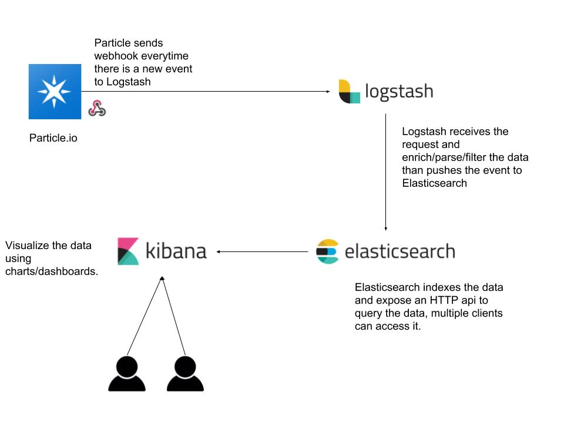

# Code For Miami - flood-tracker-service

## Overview

The idea behind this project is to have a service that receives HTTP requests parses/filters the data and push it to the DB, in our case Elasticsearch.

Documentation on the tools in this repo

Elasticsearch - https://www.elastic.co/guide/en/elasticsearch/reference/current/index.html

Logstash - https://www.elastic.co/guide/en/logstash/current/index.html

Kibana - https://www.elastic.co/guide/en/kibana/current/index.html

## Flowchart




## Prerequisite

Install on your system

* [Docker](https://www.docker.com/)


## Running the project

Open command-line in the folder and run

```
docker-compose up -d
```

## Send a test request

To send a test request and see the event in Kibana just open command-line and run the following CURL command

```
curl -X POST \
  http://localhost:8080/ \
  -H 'cache-control: no-cache' \
  -d '{
    "event": "[event-name]",
    "data": "[event-data]",
    "published_at": "[timestamp]",
    "coreid": 1,
    "debug": "true"
}'
```

The event will be shown in Kibana, of course you can send as many as you want and try other JSON doecuments.

## Access the UI

To access the UI go to `http://localhost:5601`

For the first time you access the UI after you already have some information in the DB you would need to configure the index pattern, use the index pattern below:

```
logstash-*
```

Docs to configure the index pattern - https://www.elastic.co/guide/en/kibana/current/tutorial-define-index.html

## Open tunnel to send information from Particle.io to your local system

* Install [`ngrok`](https://ngrok.com/)
* Create a free account
* Run `ngrok http 8080` in a new terminal - this will create a tunnel between `ngrok` and your local system and will provide a URL to give to Particle.io webhook integration.
* Start receiving events from Particle.io.


## Contribute to the project

Elasticsearch and Kibana are black boxes in this project and there is nothing to change there.

To edit Logstash configuration:

* All configuration files are in `logstash-config`
* When you edit a file in your favorite editor, Logstash in the container will pick up the changes and restart the process.
